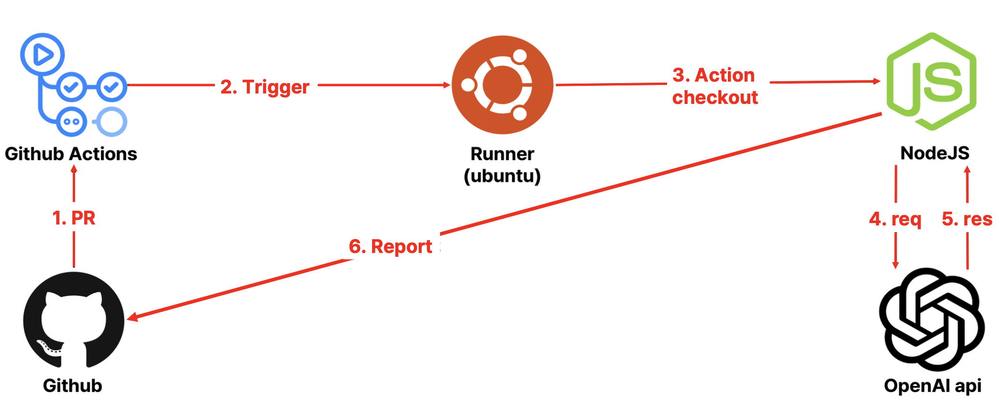

# JK-FE-conf

## 개요
잡코리아에서 진행한 FE-conf 에서 AI를 주제로 발표했던 자료를 정리한 프로젝트 입니다

## AI 도구들 비교 및 분석

## Prompt

- Make me a calendar component to use react
- The header should show the year and month
- The left arrow icon and the right arrow icon are icons that move to the previous and next month, respectively.
- Please implement logic as well.
  - ex) If you move from April to March, you should get a date that fits in March The date of the month before the date of the current month must be marked with the date of the month after the date of the current month, and the date of the previous month and the date of the next month must be disabled.
- Please make sure to implement it in logic The first and last dates are backgroundColor: primary500, color: white
- The color between the first and last dates is backgroundColor:primary100, color:white disabled dates is backgroundColor: disabled, color: gray300 Other date colors are backgroundColor: white, color: black
- You can choose two dates and keep them as useState.
- Make a logic that changes the color of all the dates between the two dates you choose.
  - ex) 14 days If you choose the 21st, all dates between the 14th and 21st should be changed in color, and even if you choose the 21st, all dates between the 14th and 21st should be changed in color.
-  Please implement it as logic primary500: '#006879' primary100: '#A9EDFF' disabled: '#ddd' gray300: '#aaa'
### VercelV0
- [source](https://github.com/leeyc924/JK-FE-conf/blob/main/src/VercelV0/index.tsx)
- Beta버전 이지만 정확도가 매우 높았다
- Next app router 부터 사용되는 RSC와 RCC를
구분지어서 코드를 만들어준다
- 컴포넌트 사용 예시까지 나온다
- 미리보기를 제공해준다
- Shadcn/UI와 호환이 좋다
- 무료버전은 하루 3번만 호출 가능하다
### WebCrumbs
- [source](https://github.com/leeyc924/JK-FE-conf/blob/main/src/WebCrumbs/index.tsx)
- 정확도 낮고 느리다
- Tailwind css로만 추천해준다
- 한번에 긴 prompt를 요청하면 에러 난다
- 로직을 구현하지 않고 퍼블리싱만 해준다
### CursorAIMarkDown
- [markdown prompt](https://github.com/leeyc924/JK-FE-conf/blob/main/src/CursorAIMarkDown/prompt.md).
- 마크다운으로 프롬프트 요청시 조건이 많이 붙는
로직에는 미흡함
- 최상위 모델인 o1-mini로 요청해야 로직을 다
구성해준다

## AI 코드리뷰

아키텍처 구성은 다음과 같습니다

풀리퀘스트후 나온 결과입니다
- [PR](https://github.com/leeyc924/JK-FE-conf/pull/1)
- [AI CodeReviewer](https://github.com/leeyc924/ai-codereviewer)
